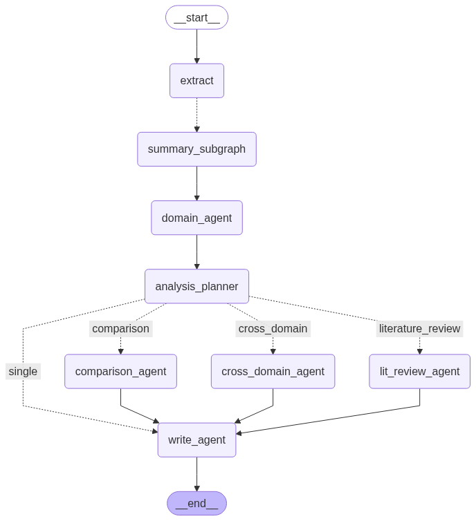

# Automated Research Paper Analysis and Summarization

본 과제는 LangGraph를 기반으로 이뤄졌습니다.
제안된 모든 테스트 케이스에 대한 결과가 포함되어 있습니다.

## Repo

```
main.py     				# run
run.ipynb   				# run(recommend)
📂[agents]					# LangGraph agents
	analysis_comparison_agent.py
	analysis_cross_domain_agent.py
	analysis_lit_review_agent.py
	analysis_plan_router.py
	domain_agent.py
	summary_agent.py
	write_agent.py
	📂[tools] 					# tools for agents
		arxiv.py      				# arXiv searching tool
		python_repl.py  			# pythonREPL tool
		vectorstore.py  			# vectorstore retriever tool
		web_search.py   			# web search tool
📂[cache]   				# results after execution
	(...)
📂[config]
	agent_config.json   		# agents llm config
	agent_llm.py 				# agents llm calling
	logging_config.py   		# logger config
📂[src]
	graph.py      				# graph(LangGraph)
	state.py      				# state(LangGraph)
	load_doc.py   				# document(pdf) loader
	tracking.py   				# input/output token tracking
📂[test]       	  
	📂[case1]     				# paper for "single-paper analysis"
	📂[case2]     				# papers for "multi-paper comparison"
	📂[case3]     				# papers for "literature review synthesis"
	📂[caseE]     				# paper for "cross-domain paper"
📂[test_output] 			# example outputs
	(...)
```

## Topology

```
[PDF Ingest]
   → (Extract)
      └→ (Documant Parsing) → (Paragraph Chunking) → (Embedding)
   → [Summary Subgraph]
	  └→ (Summary: section) → (Summary: paper)
   → [Domain Identity Agent]
   → [Analysis Plan Router] ─┬─→ [Comparison Agent]
                          	 ├─→ [LitReview Agent]
							 └─→ [Cross-Domain Agent]
   → [Writing Agent]
```



## Agent descriptions

자세한 내용은 `agents/Info.md`를 참고하세요.


---

# Installation

## 1. GROBID 설치

**Docker는 필수적으로 설치 되어 있어야 합니다.** 설치되어 있지 않다면, 다음을 참고하세요. [링크](https://docs.docker.com/get-started/docker-overview/)
GROBID는 scientific paper parsing에 특화된 ML 라이브러리로, 본 시스템에서는 입력된 pdf에서 텍스트를 추출하는 tool로 사용됩니다.
    - GROBID 설치에 대한 세부 정보는 다음을 참고하세요. [링크](https://grobid.readthedocs.io/en/latest/Grobid-docker/)
- 아래 두 옵션 중 하나를 선택하여 터미널에서 설치 및 구동하여 docker container가 실행되어야 합니다.

### ❌ opt1. **Deep Learning and CRF image**

- 딥러닝 모델을 기반으로 가장 강력한 추출 성능을 내는 버전입니다.
- 설치에 10GB의 공간이 필요합니다.
- 단, 현재(25.08.16 기준) Linux OS에서만 지원됩니다.
    - 본 과제에서 사용되지 않았습니다.

```
docker pull grobid/grobid:0.8.2
```

```
docker run --rm --gpus all --init --ulimit core=0 -p 8070:8070 grobid/grobid:0.8.2
```

### ✅ opt2. **CRF-only image**

- CRF 모델을 기반으로 추출을 수행하는 lightweight 버전입니다.
- 설치에 300MB의 공간이 필요합니다.
- Linux/Windows/Mac OS에서 작동됩니다.
    - 본 과제는 해당 image를 기반으로 수행되었습니다.

```
docker pull lfoppiano/grobid:0.8.2
```

```
docker run --rm --init --ulimit core=0 -p 8070:8070 lfoppiano/grobid:0.8.2
```

## 2. 가상환경 세팅

- 가상환경 설정
    
    ```
    conda create -n taskpaper python=3.11 
    conda activate taskpaper
    ```
    
- 패키지 설치
    
    ```
    pip install -r requirments.txt
    ```
    

---

# Execution

- `run.ipynb`를 확인하세요.

# Results

실행 및 분석이 완료되면 `cache` 폴더에 결과가 저장됩니다.
```
📁[cache]
	📁[(timestamp)]
		📁[paper_1]
			📁[vectorstore]		# raw text vector stored in local
			📁[summaries]		# all summary included
				(...)
		📁[paper_2]
			(...)
		📁(...)
		eval.json				# evaluation results
		process.log				# log
		execution_tracking.json # tracking results
		report.md				# final output of system
```
