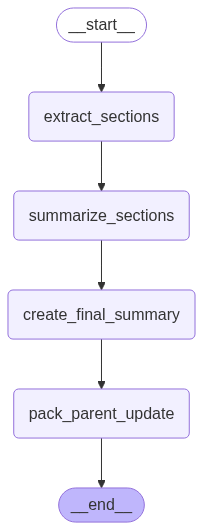

# Summary Agent
- 역할
	1. 현재 섹션 텍스트와 일관성을 유지하기 위한 방법으로 이전 섹션 요약본까지 추가로 입력으로 받고 섹션 단위 요악을 수행
	2. 섹션 단위 요약본들을 기반으로 전체 요약본을 생성
입력된 논문의 수 만큼 subgraph가 동적으로 생성되며, 요약의 과정이 긴 편이기 때문에, 모든 subgraph는 send API를 통해 병렬적으로 요약을 수행한다. subgraph의 구조는 아래와 같다.
	

# Domain Identity Agent

- 역할
	- 입력된 논문의 메인/서브 분야를 파악
	 	- main field (ex. Computer Science, Physics, Psychology)
		- sub field (ex. Machine Learning, Quantum Physics, Cognitive Psychology)
Analysis Plan Router의 기준이 되는 출력값을 반환한다.

# Analysis Plan Router

- 역할
  - LLM에 field 정보와 아래의 질문을 부여하여 다음 노드 분기 동적으로 결정

(입력된 논문의 수가 1개인 경우)
"논문의 main field를 보았을 때, cross-domain인가?"
    Y → `cross_domain_agent`
    N → `write_agent`
(입력된 논문의 수가 2+개인 경우)
"논문들의 main/sub field를 보았을 때, 연관성이 깊은가?"
    Y → `comparison_agent`
    N → `lit_review_agent`

# Cross-domain Agent

- 역할
	- cross-domain paper를 위한 분석 report 작성

# Comparison Agent

- 역할
	- 다중 논문 비교를 위한 분석 report 작성

# Literature Review Agent

- 역할
	- 문헌 리뷰를 위한 분석 report 작성

 위 세 분석 에이전트 모두 웹 서치 및 vectorstore retriever 툴 접근 가능
 문헌 리뷰 에이전트의 경우, “연구 방향 제시”를 수행하기 위해 arXiv 서치 툴 접근 가능
 
# Writing Agent

- 역할
	- 본 그래프의 최종 출력물 생성
 
블로거 페르소나를 부여하여 보다 친근한 어투를 구사하도록 유도했으며, 동시에 markdown 형식의 출력을 강조해 더 읽기 편한 형태의 report 제공하도록 함
입력된 논문이 python 구현 가능한 경우를 위해, pythonREPL을 tool로 부여하여 구현 디테일 포착 가능
